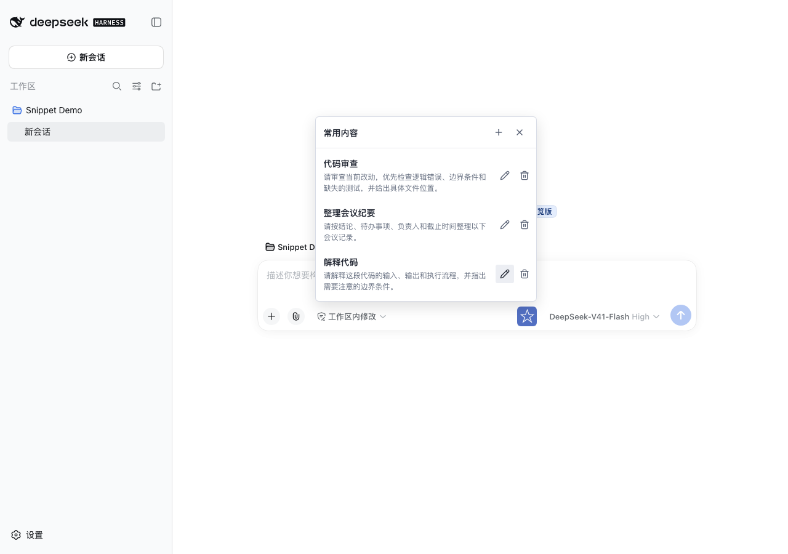
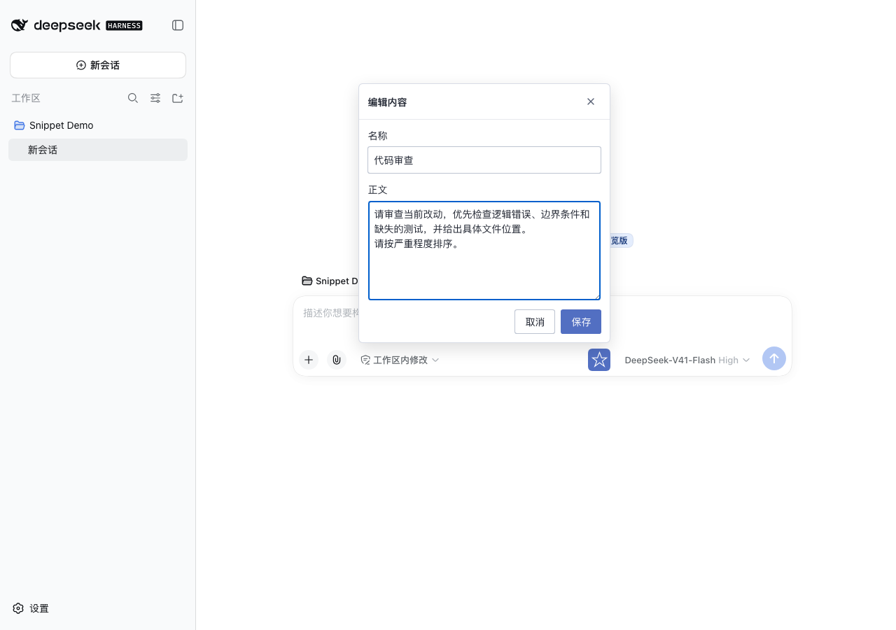
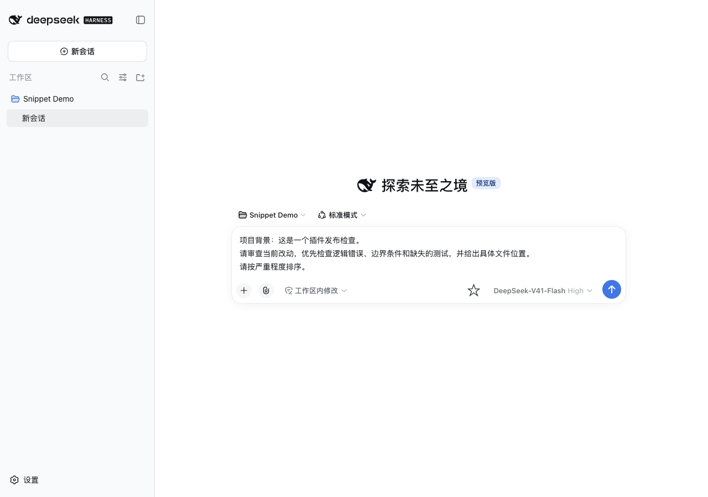

# dsh-input-list

**dsh 常用内容插件：保存常用提示词，点击即可填入输入框。**

把反复输入的代码审查要求、写作模板、项目背景保存为列表，在对话输入框旁随时调用。
点击条目只会追加到草稿，不覆盖已有文字，也不会自动发送消息。

## 功能

| 功能 | 行为 |
| --- | --- |
| 输入框入口 | 点击输入框旁的 `☆` 打开常用内容 |
| 新增 | 自定义名称和正文 |
| 编辑 | 修改已有条目的名称、正文 |
| 删除 | 二次确认后删除 |
| 保存 | 通过 dsh 宿主设置服务持久化 |
| 回填草稿 | 点击条目追加正文，保留输入框已有内容 |
| 显示适配 | 支持浅色、深色外观，弹层随窗口边界定位 |

每份列表最多 100 条，名称最多 80 个字符，正文最多 12,000 个字符。
保存内容属于当前 dsh 宿主设置，不是单个聊天的私有收藏；请勿在共享宿主中保存密码或 API Key。

## 效果

下图来自隔离测试环境中的实际 dsh 页面，使用演示内容，不包含个人会话或凭据。

### 常用内容列表



### 编辑与保存



### 点击回填



## 安装

需要已安装 dsh，且 web 客户端提供 `conversation.input.right` 插槽和
`settingsScope` 服务。先确保 `dsh --version` 能正常运行。

### 从 GitHub 安装

```bash
dsh plugin --profile web add github:konglong87/dsh-input-list
```

首次使用 web profile 可先执行 `dsh --profile web`，等待启动后按 Ctrl+C 停止，
再运行上面的安装命令。安装完成后重启对应的 dsh 进程，并刷新浏览器：

```bash
dsh --profile web
```

需要指定端口时：

```bash
dsh --profile web --port 3080 --no-open
```

如果该端口已有实例，请先停止旧实例或改用空闲端口。不要把终端输出的登录 token 分享给他人。

### 从 Release 安装

在 [Releases](https://github.com/konglong87/dsh-input-list/releases) 下载 `.tgz` 插件包，
使用文件的**绝对路径**安装：

```bash
dsh plugin --profile web add /absolute/path/dsh-input-list-0.1.0.tgz
```

### npm 状态

本次发布到 GitHub，不等于发布到 npm。**本仓库初次公开时没有执行 npm 发布。**
在确认 npm 上已有本作者发布的对应版本前，请使用上面的 GitHub 或 Release 安装方式，
不要把裸包名安装作为已可用的渠道。

## 使用

1. 打开 dsh 的对话输入框，点击右侧 `☆`。
2. 点击 `+`，填写名称和正文，保存。
3. 点击列表中的条目，将正文追加到当前草稿；确认后自行发送。
4. 点击条目旁的铅笔修改，点击垃圾桶并确认后删除。

插件附带三条演示内容，可以编辑或删除。已有输入内容与插入的正文之间会自动补换行。

## 更新与卸载

更新 GitHub 安装：

```bash
dsh plugin --profile web add github:konglong87/dsh-input-list
```

检查安装记录：

```bash
dsh plugin --profile web list
```

卸载：

```bash
dsh plugin --profile web remove dsh-input-list
```

操作后重启对应 profile。卸载包不等于清空宿主设置，不应依靠卸载来擦除敏感内容。
如果使用指定 tag/commit 安装，需要将安装引用改为目标版本。

## 兼容性

核心功能是输入框的常用内容列表，**不依赖历史消息星标补丁**。
历史消息的“添加到常用内容”是可选实验功能：只有宿主提供
`conversation.chat.user-actions` 时才显示，不支持该插槽时跳过。
本仓库不修改或打补丁到用户的 dsh。

已验证环境与尚未覆盖的范围见 [验证记录](docs/VERIFICATION.md)。
不能据此保证所有未来或旧版 dsh 均兼容；无法保存时请先确认连接的宿主提供可写设置服务。

### 从旧实验包迁移

旧包名为 `dsh-input-list-demo`。请不要同时启用新旧两个包：

```bash
dsh plugin --profile web remove dsh-input-list-demo
dsh plugin --profile web add github:konglong87/dsh-input-list
```

内部设置键仍是 `dsh-input-list-demo`，这是为了保留原来的常用内容，并非安装错误。
迁移前建议备份自己的 dsh 设置。

## 开发

```bash
git clone https://github.com/konglong87/dsh-input-list.git
cd dsh-input-list
npm ci
npm run build
npm test
npm pack --dry-run
```

仓库提交构建产物，便于 GitHub 安装；改动源码后请重新构建。

| 文件 | 职责 |
| --- | --- |
| `cordis.patch.yml` | 告诉 dsh 如何加载插件 |
| `src/host.js` | 注册设置结构与服务端校验 |
| `src/client.jsx` | 注入客户端服务并注册入口 |
| `src/panel.jsx` | 共用列表、编辑器、删除确认 |
| `src/model.js` | 常量、校验、条目操作与草稿拼接 |
| `src/styles.css` | 插件自身样式 |
| `index.js` / `client.js` | 服务端 / 浏览器构建产物 |
| `tests/` | 加载、兼容性和数据操作测试 |

## 文档与反馈

- [版本记录](CHANGELOG.md)
- [发布指南](PUBLISH.md)
- [实验宿主插槽说明](HOST-INTEGRATION.md)
- [反馈问题](https://github.com/konglong87/dsh-input-list/issues)

反馈请附 dsh 版本、插件版本、安装方式、复现步骤和脱敏截图；不要上传 token、API Key 或个人会话。
